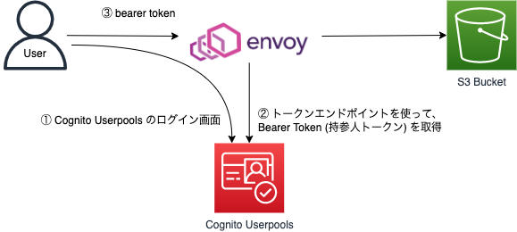

Kubernetes 環境へのインストール
===



values.yaml を local-values.yaml でコピーします。 

```shell
cp values.yaml local-values.yaml
```

環境に合わせて、local-values.yaml を修正してください。

```shell
helm install s3 --values=local-values.yaml ./envoy
kubectl port-forward svc/s3-envoy 8080:80
```

ブラウザを使って "http://localhost:8080" にアクセスします。
